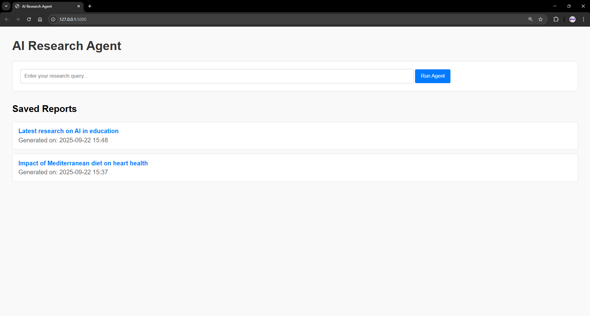
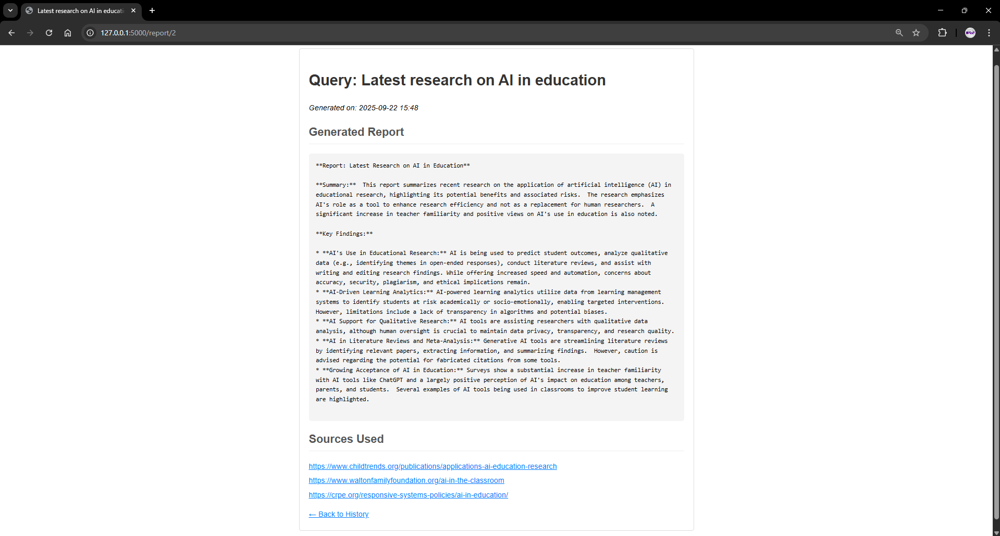

# AI Research Agent

This project is an autonomous AI agent designed to automate the process of online research. It takes a user query, finds relevant online sources, extracts and summarizes the content using an LLM, and saves the findings into a structured report. The saved reports can be viewed through a simple web interface.

---

## Screenshots

Here's a look at the web interface in action.

**Home Page:**


**Report View Page:**


---
## Features

* **Web-Based Interface:** Allows users to submit research queries directly from their browser.
* **Autonomous Web Search:** Uses the Tavily API to find relevant, up-to-date sources online.
* **Multi-Format Content Extraction:** Capable of parsing and extracting clean text from both standard web pages (HTML) and PDF documents.
* **LLM-Powered Summarization:** Leverages the Google Gemini API to generate concise, structured reports with key findings.
* **Persistent Memory:** Saves all generated reports in an SQLite database for future reference.
* **Report History Viewer:** A simple and clean web UI built with Flask to browse and view all saved research reports.

---

## Architecture

The agent follows a simple yet powerful workflow:

1.  **Query Submission:** The user enters a research query into the web form and submits it.
2.  **Web Search:** The Flask application triggers the agent, which uses the **Tavily API** to search the web and retrieve a list of the most relevant URLs.
3.  **Content Extraction:** The agent iterates through each URL. It uses the **Trafilatura** library to scrape text from HTML pages and the **PyPDF** library to extract text from PDF documents. It includes error handling to gracefully skip sources that are inaccessible or block scraping.
4.  **LLM Summarization:** All the extracted text is compiled and sent to the **Google Gemini API** with a carefully crafted prompt. The LLM then generates a structured report summarizing the information.
5.  **Database Storage:** The final report, along with the original query and source URLs, is saved as a new entry in the **SQLite** database using SQLAlchemy.
6.  **Display Results:** The user is redirected back to the homepage, which now lists the newly created report. Users can click on any report in the history to view its full content.

---

## Tech Stack

* **Backend:** Python, Flask
* **LLM:** Google Gemini API
* **Web Search:** Tavily Search API
* **Database:** SQLite with SQLAlchemy
* **Content Extraction:** Trafilatura (HTML), PyPDF (PDF)
* **Environment Management:** `python-dotenv`

---

## Setup and Usage

Follow these steps to set up and run the project locally.

### 1. Prerequisites

* Python 3.8+
* Git

### 2. Installation

First, clone the repository to your local machine:
```bash
git clone <your-repository-url>
cd <repository-folder-name>
```

Next, create and activate a Python virtual environment:
```bash
# For macOS/Linux
python3 -m venv venv
source venv/bin/activate

# For Windows
python -m venv venv
venv\Scripts\activate
```

Install the required dependencies from the `requirements.txt` file:
```bash
pip install -r requirements.txt
```

### 3. Configuration

Before running the application, you need to set up your API keys.

Create a file named `.env` in the root of the project directory and add your API keys in the following format:
```
GEMINI_API_KEY="YOUR_GEMINI_API_KEY_HERE"
TAVILY_API_KEY="YOUR_TAVILY_API_KEY_HERE"
```

### 4. Running the Application

To start the web server, run the following command in your terminal:
```bash
flask run
```
Open your web browser and navigate to **`http://127.0.0.1:5000`**. You can now use the web interface to run the agent and view reports.

---

## Example Result

Here is an example of a report generated by the agent.

**Sample Query:**
> "Latest research on AI in education"

**Generated Report:**
> **Title:** AI in Education Research: Current Applications and Ethical Considerations
>
> **Summary:** This report summarizes recent research on the applications of artificial intelligence (AI) in education research, highlighting both its promising uses and associated ethical concerns. The research covers AI's role in analyzing quantitative and qualitative data, conducting literature reviews, and assisting with the research process itself. It also addresses the growing use of AI tools in the classroom.
>
> **Key Findings:**
> * **AI's Use in Educational Research:** AI is being used to predict student outcomes, analyze qualitative data (e.g., identifying themes in open-ended responses), conduct literature reviews, and assist with writing and editing research findings. While offering increased speed and automation, concerns about accuracy, security, plagiarism, and ethical implications remain.
> * **AI-Driven Learning Analytics:** AI-powered learning analytics utilize data from learning management systems to identify students at risk academically or socio-emotionally, enabling targeted interventions.  However, limitations include a lack of transparency in algorithms and potential biases.
> * **AI Support for Qualitative Research:** AI tools are assisting researchers with qualitative data analysis, although human oversight is crucial to maintain data privacy, transparency, and research quality.
> * **AI in Literature Reviews and Meta-Analysis:** Generative AI tools are streamlining literature reviews by identifying relevant papers, extracting information, and summarizing findings.  However, caution is advised regarding the potential for fabricated citations from some tools.
> * **Growing Acceptance of AI in Education:** Surveys show a substantial increase in teacher familiarity with AI tools like ChatGPT and a largely positive perception of AI's impact on education among teachers, parents, and students.  Several examples of AI tools being used in classrooms to improve student learning are highlighted.
>
> **Sources Used**
> * https://www.childtrends.org/publications/applications-ai-education-research
> * https://www.waltonfamilyfoundation.org/ai-in-the-classroom
> * https://crpe.org/responsive-systems-policies/ai-in-education/

---
